# Klyro

Klyro is an AWS-native pipeline that takes a small Node/Express/Postgres
demo app with two deliberately seeded performance bugs and, with a single
invocation, automatically:

1. **builds** it (CodeBuild → Docker → ECR),
2. **deploys** it to an isolated ECS/Fargate environment,
3. **load-tests** it (k6) and compacts the results into metrics,
4. asks an LLM (Mistral) to **diagnose** the anomaly and propose a **code
   fix** for it,
5. verifies that fix against a strict allowlist + content-hash guard,
6. **rebuilds, redeploys, and re-tests** with the fix applied,
7. and produces a **deterministic, code-evaluated** before/after verdict —
   `OPTIMIZATION VALIDATED` or `NOT VALIDATED` — never an LLM's opinion.

Everything — every image tag, every S3 object, every metric — is keyed by
a single `runId` (`klyro-<unix-ts>-<6-char-hash>`), so a `baseline` run and
its paired `optimized` run are always comparable apples-to-apples: same
task CPU/memory/replica count, same load profile, same freshly-reseeded
database.

The project's non-negotiable rules (allowlist, hash verification,
evaluator thresholds, IAM posture, etc.) live in [`CLAUDE.md`](CLAUDE.md)
— this README explains *how the system is built*; CLAUDE.md is the
authoritative *contract* it's built to satisfy.

---

## Table of contents

- [Why it exists](#why-it-exists)
- [The two seeded bugs](#the-two-seeded-bugs)
- [Architecture](#architecture)
- [Repository layout](#repository-layout)
- [The CDK stacks](#the-cdk-stacks)
- [The eight Lambdas](#the-eight-lambdas)
- [The pipeline, state by state](#the-pipeline-state-by-state)
- [The evaluator's verdict rule](#the-evaluators-verdict-rule)
- [Security & IAM posture](#security--iam-posture)
- [Deploying it yourself](#deploying-it-yourself)
- [Running a pipeline execution](#running-a-pipeline-execution)
- [Known operational gotchas](#known-operational-gotchas)
- [Current status](#current-status)

---

## Why it exists

Most "AI fixes your code" demos stop at the LLM producing a diff and a
human eyeballing whether it looks right. Klyro is built around a
different question: **can the loop close itself, and can the claim of
improvement be checked by code instead of by an LLM grading its own
homework?**

Concretely, that means:

- The LLM never decides whether its own fix worked. A separate,
  deterministic `evaluator` Lambda does, using fixed thresholds.
- The LLM never gets to touch arbitrary files. A `guard` Lambda checks
  the proposed patch's target file against a fixed allowlist and its
  claimed pre-image hash against the *actual* current file before any
  build happens.
- Baseline and optimized runs use **identical** infrastructure (same
  Fargate CPU/memory/replica count) and **identical** starting data (the
  database is dropped, recreated, and reseeded before both runs) — so a
  measured improvement is attributable to the code change, not to noise.

## The two seeded bugs

`demo-app/` is a minimal Express + Postgres API with two intentional
performance defects, planted specifically so the Investigator has
something concrete and fixable to find:

| # | Where | Bug | Fix shape |
|---|-------|-----|-----------|
| 1 | `demo-app/src/orders.js` — `GET /orders` | **N+1 query**: fetches a page of orders, then issues one `SELECT` per order to look up its product, instead of one batched `WHERE id IN (...)`. At `pageSize=50` that's 1 + 50 = 51 queries per request. | Batch the product lookups into a single query. |
| 2 | `demo-app/src/logger.js` + `demo-app/config/logger.json` | **Synchronous, unbatched log flush**: every `logger.*()` call does an immediate `process.stdout.write()` (one syscall per line) instead of batching writes on `logger.json`'s already-present-but-unused `flushIntervalMs`. | Batch writes on the configured interval. |

The k6 load profile (`k6/load-script.js`) is shaped specifically to
surface bug #1 in `p95_ms` and `db_queries_per_request` (15 constant VUs
hammering `/orders?pageSize=50` against a 10-connection pg pool queues
visibly) while leaving `/products` flat, giving the Analyst a clear
anomaly to point at.

## Architecture

```mermaid
flowchart TB
    subgraph EXTERNAL["External"]
        USER["You (aws lambda invoke)"]
        MISTRAL["Mistral API\n(chat completions, OpenAI-compatible)"]
    end

    subgraph AWS["AWS Account — ap-south-1"]
        subgraph ORCH["Orchestration (Klyro-OrchestrationStack)"]
            TRIGGER["trigger λ"]
            SFN["Step Functions\nklyro-experiment\n(Standard workflow)"]
            L1["deploy-app λ"]
            L2["metrics-compactor λ"]
            L3["analyst λ"]
            L4["investigator λ"]
            L5["guard λ"]
            L6["evaluator λ"]
            L7["report-writer λ"]
            SSM["SSM Parameter Store\n/klyro/mistral-api-key\n(SecureString)"]
        end

        subgraph BUILD["Build (Klyro-BuildStack)"]
            CB["CodeBuild\nklyro-app-build\n(privileged, Docker layer cache)"]
        end

        subgraph DATA["Data (Klyro-DataStack)"]
            ECRAPP["ECR: klyro-app"]
            ECRK6["ECR: klyro-k6"]
            S3["S3: klyro-runs-<account>\nruns/<runId>/<phase>/*\n(14-day lifecycle)"]
        end

        subgraph COMPUTE["Compute (Klyro-ComputeStack) — inside klyro-vpc, public subnets, no NAT"]
            CLUSTER["ECS Cluster: klyro-cluster\n(Container Insights)"]
            APPSVC["Fargate service: klyro-app\n(512 CPU / 1024 MiB, fixed)"]
            DBSVC["Fargate service: klyro-db\n(postgres:16)"]
            DBINIT["Fargate task: klyro-db-init\n(DROP/CREATE SCHEMA + seed)"]
            K6TASK["Fargate task: klyro-k6\n(k6 + run-and-upload.sh)"]
            CW["CloudWatch\nContainer Insights CPU +\nEMF custom metrics\n(db_queries, flush_ops)"]
        end

        subgraph NET["Network (Klyro-NetworkStack)"]
            VPC["klyro-vpc — 2 AZs, public only"]
        end
    end

    USER -->|"aws lambda invoke"| TRIGGER
    TRIGGER -->|"StartExecution({runId})"| SFN
    SFN -->|".sync"| CB
    SFN -->|".sync RunTask"| DBINIT
    SFN -->|"Invoke"| L1
    SFN -->|".sync RunTask"| K6TASK
    SFN -->|"Invoke"| L2
    SFN -->|"Invoke"| L3
    SFN -->|"Invoke"| L4
    SFN -->|"Invoke"| L5
    SFN -->|"Invoke"| L6
    SFN -->|"Invoke"| L7
    SFN -->|"DescribeServices\n(poll rollout)"| APPSVC

    L1 -->|"RegisterTaskDefinition +\nUpdateService"| APPSVC
    CB -->|"docker push runId-phase"| ECRAPP
    APPSVC -->|"pulls"| ECRAPP
    K6TASK -->|"pulls"| ECRK6
    K6TASK -->|"HTTP load"| APPSVC
    APPSVC <-->|"Cloud Map\napp.klyro.internal / db.klyro.internal"| DBSVC
    DBINIT -->|"psql seed"| DBSVC
    K6TASK -->|"PutObject results.json"| S3
    L2 -->|"GetMetricData"| CW
    APPSVC -->|"EMF log lines"| CW
    L2 -->|"GetObject results.json /\nPutObject summary.json"| S3
    L3 -->|"GetObject summary.json /\nPutObject finding.json"| S3
    L3 & L4 -->|"GetParameter\n(decrypt)"| SSM
    L3 & L4 -->|"chat/completions"| MISTRAL
    L4 -->|"GetObject finding+summary /\nPutObject patch.json"| S3
    L5 -->|"GetObject patch.json /\nPutObject patch.verified.json"| S3
    CB -->|"GetObject patch.verified.json\n(optimized builds only)"| S3
    L6 -->|"GetObject both summaries /\nPutObject evaluation.json"| S3
    L7 -->|"GetObject everything /\nPutObject report.json"| S3
```



## Repository layout

```
Klyro/
├── CLAUDE.md                    # project constitution — invariants, thresholds, conventions
├── infra/                       # AWS CDK app (TypeScript)
│   ├── bin/klyro.ts              #   entry point: wires all 5 stacks + dependencies
│   └── lib/
│       ├── network-stack.ts      #   VPC (2 AZ, public-only, no NAT)
│       ├── data-stack.ts         #   ECR (klyro-app, klyro-k6) + S3 runs bucket
│       ├── compute-stack.ts      #   ECS cluster, app/db services, db-init + k6 task defs
│       ├── build-stack.ts        #   CodeBuild project (builds demo-app's Docker image)
│       └── orchestration-stack.ts#   8 Lambdas + Step Functions state machine + IAM
├── demo-app/                    # the app under test — Express + Postgres, 2 seeded bugs
│   ├── src/{index,orders,logger,db,metrics,requestContext}.js
│   ├── src/routes/{auth,products,health}.js
│   ├── config/logger.json        #   flushIntervalMs (present, unused until bug #2 is fixed)
│   └── db/seed.sql
├── k6/                           # load-test image
│   ├── load-script.js            #   20s warmup + 70s measurement, tagged by phase
│   ├── run-and-upload.sh         #   runs k6, uploads results.json to S3
│   └── Dockerfile
├── lambdas/                      # one handler per directory, Node 20.x
│   ├── trigger/                  #   starts a new execution with a fresh runId
│   ├── llm-provider/              #   MistralProvider — shared HTTP client + retry/schema logic
│   ├── deploy-app/                #   registers a task-def revision + UpdateService
│   ├── metrics-compactor/         #   k6 results.json + CloudWatch EMF → summary.json
│   ├── analyst/                   #   LLM call #1: diagnose the anomalous metric
│   ├── investigator/               #   LLM call #2: propose a full-file patch
│   ├── guard/                     #   deterministic allowlist + sha256 verification
│   ├── evaluator/                  #   deterministic PASS/FAIL verdict
│   └── report-writer/              #   assembles runs/<runId>/report.json
└── statemachine/
    └── experiment.asl.json        # the full pipeline, hand-authored as literal ASL
```

## The CDK stacks

Five independently-deployable stacks, deployed in dependency order
`Network → Data → Compute → Build → Orchestration`:

| Stack | Key resources | Notes |
|---|---|---|
| **NetworkStack** | `klyro-vpc`, 2 AZs, public subnets only, `natGateways: 0` | No NAT because nothing in the VPC needs outbound internet except pulling `postgres:16`/npm packages, which public-subnet + `assignPublicIp: true` already covers. Saves a NAT Gateway's fixed hourly cost. |
| **DataStack** | ECR `klyro-app` / `klyro-k6`, S3 `klyro-runs-<account>` | Bucket blocks all public access, SSE-S3 encrypted, 14-day lifecycle expiry on every object, `autoDeleteObjects` so `cdk destroy` doesn't leave orphaned buckets. |
| **ComputeStack** | ECS cluster, `klyro-app`/`klyro-db` Fargate services, `klyro-db-init`/`klyro-k6` task defs, Cloud Map namespace `klyro.internal`, Secrets Manager DB credential | App/db task CPU/memory are **fixed constants**, never varied between baseline/optimized — that fixity is what makes the evaluator's comparison valid. `db-init`'s seed script is embedded via CDK's `fs.readFileSync` at synth time, not baked into the image, so editing `demo-app/db/seed.sql` and redeploying is enough to change seed data. |
| **BuildStack** | CodeBuild project `klyro-app-build` | Source is **one static** `source/baseline.zip` (just `demo-app/`, uploaded once, out-of-band) — not a fresh per-run zip. An "optimized" build reads `patch.verified.json` from S3 in `pre_build` and rewrites the target file in place with a one-line `node -e` script before `docker build`, so both phases build from the exact same source tree modulo that one file. |
| **OrchestrationStack** | 8 Lambdas, the `klyro-experiment` state machine (`CfnStateMachine`, literal ASL), all IAM | See below. |

## The eight Lambdas

| Lambda | Reads | Writes | Talks to |
|---|---|---|---|
| `trigger` | — | starts a Step Functions execution | Step Functions (`StartExecution`, scoped to the one state machine ARN) |
| `deploy-app` | current `klyro-app` task def | new task-def revision + `UpdateService` | ECS |
| `metrics-compactor` | `runs/<id>/<phase>/results.json` | `runs/<id>/<phase>/summary.json` | CloudWatch `GetMetricData` (EMF `db_queries`/`flush_ops` + `AWS/ECS` CPUUtilization) |
| `analyst` | `summary.json` | `finding.json` | Mistral (`LLM_MODEL_ANALYST`, default `mistral-small-latest`) |
| `investigator` | `finding.json` + `summary.json` + the 3-file allowlist manifest | `patch.json` | Mistral (`LLM_MODEL_INVESTIGATOR`, default `mistral-large-latest`) |
| `guard` | `patch.json` | `patch.verified.json` | — (pure verification, no external calls) |
| `evaluator` | both phases' `summary.json` | `evaluation.json` | — (pure arithmetic against fixed thresholds) |
| `report-writer` | everything above, all reads optional | `report.json` | — |

`llm-provider/` isn't a Lambda itself — it's a shared module
(`MistralProvider`) that `analyst` and `investigator` both `require()`.
It owns the OpenAI-compatible chat-completions call, the minimal
hand-rolled JSON-Schema validator (no `ajv` dependency, so the Lambda zip
stays unbundled), and the retry policy: on a schema/parse failure it
retries once with the error appended to the prompt; on a `429` it instead
backs off (honoring `Retry-After` if given) and retries the *same*
prompt unchanged. A second failure throws `AI_FAILED` — the state
machine's `Catch` blocks match on this literal error name and route to
`MarkFailed`, per CLAUDE.md's "mark the run AI_FAILED — never silently
switch models or providers mid-run."

All eight functions sit **outside the VPC** — they only ever talk to S3,
CloudWatch, SSM, the ECS control plane, and Mistral's public API, none of
which needs VPC access, so there's no NAT Gateway to pay for on their
account either.

## The pipeline, state by state

`statemachine/experiment.asl.json` is a hand-authored ~29-state Standard
workflow (not built via CDK's `Chain`/`Task` constructs, so the JSON is a
literal, auditable description of the whole flow). Every `.sync`
integration (`codebuild:startBuild.sync`, `ecs:runTask.sync`) blocks the
state machine until the underlying job actually finishes — no custom
Lambda polling loops, per CLAUDE.md.

```mermaid
flowchart TD
    START(("Start\n{runId}")) --> PAR

    subgraph PAR["Parallel"]
        direction LR
        BB["BuildBaselineImage\ncodebuild:startBuild.sync"]
        SD["SeedDatabaseBaseline\necs:runTask.sync (db-init)"]
    end

    PAR --> DEP1["DeployBaselineImage\nλ deploy-app"]
    DEP1 --> POLL1{{"Wait/Choice loop\necs:describeServices\nuntil rolloutState=COMPLETED\n(15s × 20 tries, then error)"}}
    POLL1 --> K61["RunK6Baseline\necs:runTask.sync"]
    K61 --> MC1["CompactBaselineMetrics\nλ metrics-compactor"]
    MC1 --> AN["RunAnalyst\nλ analyst (Mistral #1)"]
    AN --> INV["RunInvestigator\nλ investigator (Mistral #2)"]
    INV --> GRD["RunGuard\nλ guard\n(allowlist + sha256 check)"]

    GRD --> BO["BuildOptimizedImage\ncodebuild:startBuild.sync\n(patches file in place)"]
    BO --> DEP2["DeployOptimizedImage\nλ deploy-app"]
    DEP2 --> POLL2{{"Wait/Choice loop\n(same as above)"}}
    POLL2 --> SD2["SeedDatabaseOptimized\necs:runTask.sync (db-init)"]
    SD2 --> K62["RunK6Optimized\necs:runTask.sync"]
    K62 --> MC2["CompactOptimizedMetrics\nλ metrics-compactor"]
    MC2 --> EV["RunEvaluator\nλ evaluator\n(deterministic PASS/FAIL)"]
    EV --> RW1["RunReportWriter\nλ report-writer"]
    RW1 --> DONE(("ExperimentSucceeded"))

    PAR -. Catch: States.ALL .-> MF
    DEP1 -. Catch .-> MF
    POLL1 -. timeout .-> MF
    K61 -. Catch .-> MF
    MC1 -. Catch .-> MF
    AN -. Catch\n(incl. AI_FAILED) .-> MF
    INV -. Catch\n(incl. AI_FAILED) .-> MF
    GRD -. Catch\n(incl. GUARD_REJECTED) .-> MF
    BO -. Catch .-> MF
    DEP2 -. Catch .-> MF
    POLL2 -. timeout .-> MF
    SD2 -. Catch .-> MF
    K62 -. Catch .-> MF
    MC2 -. Catch .-> MF
    EV -. Catch .-> MF
    RW1 -. Catch .-> MF

    MF["MarkFailed\nλ report-writer({runId, error})\nwrites a minimal report.json\neven on early failure"] --> FAIL(("ExperimentFailed"))
```

Every `Catch` block sets `ResultPath: $.error` and routes to the same
`MarkFailed` state, so a failure anywhere in the pipeline still produces
a `runs/<runId>/report.json` with whatever partial data existed at the
point of failure — the execution never just errors out with no artifact.

## The evaluator's verdict rule

From CLAUDE.md, implemented exactly (and only) in
[`lambdas/evaluator/index.js`](lambdas/evaluator/index.js) — never an LLM
call:

```
p95_improvement_ratio = (baseline.p95_ms − optimized.p95_ms) / baseline.p95_ms
error_rate_delta_pp   = optimized.error_rate − baseline.error_rate   (both 0–100 scale)

OPTIMIZATION VALIDATED  ⇔  p95_improvement_ratio ≥ 0.10
                        AND error_rate_delta_pp   ≤ 0.5
                        AND optimized.cpu_percent  ≤ 95
```

All three checks are reported individually in `evaluation.json`, not just
the final verdict, so a `NOT VALIDATED` result is always explainable.

## Security & IAM posture

- **Least privilege, hand-built policies.** Every S3 grant is a specific
  `s3:GetObject`/`s3:PutObject` `iam.PolicyStatement` scoped to an exact
  `runs/.../file.json` key pattern — never `bucket.grantRead()` /
  `grantPut()`, which also pull in `GetBucket*`, `List*`,
  `PutObjectLegalHold/Retention/Tagging`, and `Abort*`. The k6 task role
  in particular is scoped to `s3:PutObject` on `runs/<runId>/*` and
  nothing else.
- **The Mistral key is a `SecureString` SSM parameter**
  (`/klyro/mistral-api-key`), never a plaintext env var. Only `analyst`
  and `investigator` can `ssm:GetParameter`/`kms:Decrypt` it.
- **The Investigator's blast radius is hard-capped.** It may only ever
  produce a patch targeting one of exactly three files
  (`demo-app/src/orders.js`, `demo-app/src/logger.js`,
  `demo-app/config/logger.json`), enforced independently by `guard` —
  not merely by the prompt. `guard` also recomputes the sha256 of the
  file's *current* content (from a manifest generated fresh at every CDK
  synth) and rejects the patch if it doesn't match the
  `original_sha256` the Investigator claimed, so a patch proposed against
  stale content can never be silently applied.
- **AWS-required wildcard exceptions are called out explicitly**, not
  left implicit: `ecr:GetAuthorizationToken`,
  `cloudwatch:GetMetricData`, `ecs:DescribeServices`/`DescribeTasks`/
  `StopTask`, `ecs:DescribeTaskDefinition`/`RegisterTaskDefinition` all
  have no resource-level ARN scoping in AWS's own IAM action reference,
  so those (and only those) are granted on `*`.
- **`.sync` service-integration permissions are scoped to the exact
  managed EventBridge rule ARNs** Step Functions creates behind the
  scenes (`StepFunctionsGetEventsForECSTaskRule`,
  `StepFunctionsGetEventForCodeBuildStartBuildRule`) — not a wildcard
  `rule/*`.
- **No NAT Gateway anywhere.** Every component either lives in a public
  subnet with a public IP (ECS tasks, which only need outbound access to
  pull images / talk to Postgres over Cloud Map) or outside the VPC
  entirely (all 8 Lambdas), so there's no NAT Gateway hourly cost or
  extra egress hop for the LLM calls.

## Deploying it yourself

Prerequisites: an AWS account, the AWS CLI configured with a profile that
can deploy CDK apps, Node 20+, Docker, and a Mistral API key.

```bash
cd infra
npm install
npx cdk bootstrap                      # once per account/region

# 1. Deploy network + data first (compute needs an ECR repo to seed from)
npx cdk deploy Klyro-NetworkStack Klyro-DataStack

# 2. Build + push a bootstrap image so the app service has something to pull
#    (see demo-app/Dockerfile) — tag it "bootstrap"
docker build -t <account>.dkr.ecr.<region>.amazonaws.com/klyro-app:bootstrap demo-app
docker push <account>.dkr.ecr.<region>.amazonaws.com/klyro-app:bootstrap

# 3. Store the Mistral key as a SecureString (CloudFormation can't create these)
aws ssm put-parameter --name /klyro/mistral-api-key --type SecureString --value "<your-key>"

# 4. Deploy the rest
npx cdk deploy Klyro-ComputeStack Klyro-BuildStack Klyro-OrchestrationStack

# 5. Upload the one static CodeBuild source zip (demo-app/ only, forward-slash
#    zip entries — see the note below if you're zipping on Windows)
#    -> s3://klyro-runs-<account>/source/baseline.zip
```

> **Windows note:** PowerShell's `Compress-Archive` writes backslash path
> separators in zip entries (`demo-app\Dockerfile`), which the Linux
> CodeBuild image can't unpack correctly. Build the zip with
> `System.IO.Compression.ZipArchive` directly (or any zip tool that
> writes POSIX-style `/` separators) instead.

## Running a pipeline execution

```bash
aws lambda invoke --function-name klyro-trigger --payload '{}' out.json
cat out.json   # {"runId": "klyro-<ts>-<hash>", "executionArn": "..."}

aws stepfunctions describe-execution --execution-arn <executionArn>
```

Every artifact for that run lands under
`s3://klyro-runs-<account>/runs/<runId>/`:

```
runs/<runId>/
├── baseline/
│   ├── results.json          # raw k6 output
│   ├── summary.json          # compacted metrics
│   ├── finding.json          # analyst's diagnosis
│   ├── patch.json            # investigator's proposed fix
│   └── patch.verified.json   # guard-verified fix (what actually got built)
├── optimized/
│   ├── results.json
│   └── summary.json
├── evaluation.json           # evaluator's deterministic verdict
└── report.json               # report-writer's final summary
```

## Known operational gotchas

A few non-obvious things we ran into building this, in case they bite you
too:

- **CDK + Step Functions `.sync` IAM ordering.** `CreateStateMachine`
  synchronously validates that the execution role can create the managed
  EventBridge rules its `.sync` integrations need — unlike Lambda's lazy,
  invoke-time IAM checks. If the role's policy is attached via a separate
  `addToPolicy()` call, CloudFormation has no ordering guarantee that the
  policy finished attaching before `CreateStateMachine` runs. Fix: build
  the policy as an explicit `iam.Policy` and give the state machine an
  explicit `node.addDependency()` on it.
- **EventBridge managed-rule names are easy to get wrong.** The actual
  name Step Functions requests for ECS `RunTask.sync` is
  `StepFunctionsGetEventsForECSTaskRule` (plural "Events") — CodeBuild's
  `StartBuild.sync` uses the singular `StepFunctionsGetEventForCodeBuild
  StartBuildRule`. Getting either wrong surfaces as a generic `AccessDenied:
  ... is not authorized to create managed-rule` with no indication of
  which name was expected; check CloudTrail for the actual denied
  `events:PutRule` call rather than guessing.
- **S3 turns a permission gap into a fake 404.** If a Lambda has
  `s3:GetObject` but not `s3:ListBucket`, a `GetObject` on a key that
  simply doesn't exist yet returns `403 AccessDenied` (mentioning
  `ListBucket`) instead of `404 NoSuchKey`. Any code that treats
  "object doesn't exist" as an expected, catchable case (this pipeline's
  `report-writer`, deliberately, since most of a run's artifacts are
  still missing when it fails early) needs `s3:ListBucket` too — scoped
  with an `s3:prefix` condition, not granted bucket-wide.
- **New AWS accounts/regions often start several service quotas at 0.**
  CodeBuild's "concurrently running builds" quota and a provider API
  key's rate limit are two independent things that can both gate the
  pipeline before it ever does real work, and neither failure looks like
  a code bug. Check `aws service-quotas get-service-quota` before
  assuming a `CodeBuild.AccountLimitExceededException` or a `429` is a
  pipeline defect.

## Current status

As of the last deploy, all five stacks (`Network`, `Data`, `Compute`,
`Build`, `Orchestration`) deploy cleanly and the following have been
verified working end-to-end, piece by piece:

- `deploy-app` → ECS rollout → `db-init` seeding → k6 load test →
  `metrics-compactor` (confirmed the seeded N+1 bug shows up as
  ~20 `db_queries_per_request` against an expected ~2)
- `guard` (valid patch, stale-hash rejection, disallowed-file rejection)
- `evaluator` (`OPTIMIZATION VALIDATED` and `NOT VALIDATED` branches)
- `report-writer` (both the happy path and the `MarkFailed` early-failure
  path)

Two AWS-account-level quotas are currently blocking a full, real
end-to-end run and are outside the pipeline's own control:

- **CodeBuild concurrent-build quota is 0** in this account/region — a
  Service Quotas increase request is open (AWS Support case, pending).
- **The configured Mistral API key is rate-limited to 0 req/minute** at
  the account level — needs resolution on Mistral's dashboard.

Once both clear, `aws lambda invoke --function-name klyro-trigger` runs
the pipeline for real.
- Internal log 2890 updated
