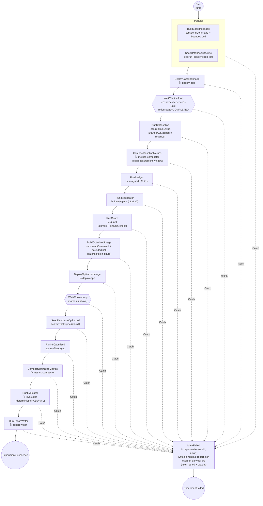

# Klyro

Klyro is an AWS-native pipeline that takes a small Node/Express/Postgres
demo app with two deliberately seeded performance bugs and, from a single
button press, automatically:

1. **builds** it (EC2 builder driven by SSM RunCommand → Docker → ECR),
2. **deploys** it to an isolated ECS/Fargate environment,
3. **load-tests** it (k6) and compacts the results into metrics,
4. asks an LLM to **diagnose** the anomaly and propose a **code fix**,
5. verifies that fix against a strict allowlist + content-hash guard,
6. **rebuilds, redeploys, and re-tests** with the fix applied,
7. and produces a **deterministic, code-evaluated** before/after verdict —
   `OPTIMIZATION VALIDATED` or `NOT VALIDATED` — never an LLM's opinion.

Everything — every image tag, every S3 object, every metric — is keyed by
a single `runId` (`klyro-<unix-ts>-<6-char-hash>`), so a `baseline` run and
its paired `optimized` run are always comparable apples-to-apples: same
task CPU/memory/replica count, same load profile, same freshly-reseeded
database.

The project's non-negotiable rules (allowlist, hash verification,
evaluator thresholds, IAM posture, etc.) live in [`CLAUDE.md`](CLAUDE.md)
— this README explains *how the system is built*; CLAUDE.md is the
authoritative *contract* it's built to satisfy.

---

## Table of contents

- [Why it exists](#why-it-exists)
- [The two seeded bugs](#the-two-seeded-bugs)
- [Architecture](#architecture)
- [Repository layout](#repository-layout)
- [The CDK stacks](#the-cdk-stacks)
- [The Lambdas](#the-lambdas)
- [The HTTP API](#the-http-api)
- [The dashboard](#the-dashboard)
- [The pipeline, state by state](#the-pipeline-state-by-state)
- [The evaluator's verdict rule](#the-evaluators-verdict-rule)
- [What a report contains](#what-a-report-contains)
- [Security & IAM posture](#security--iam-posture)
- [Deploying it yourself](#deploying-it-yourself)
- [Running a pipeline execution](#running-a-pipeline-execution)
- [Tests](#tests)
- [Known operational gotchas](#known-operational-gotchas)
- [Current status](#current-status)

---

## Why it exists

Most "AI fixes your code" demos stop at the LLM producing a diff and a
human eyeballing whether it looks right. Klyro is built around a
different question: **can the loop close itself, and can the claim of
improvement be checked by code instead of by an LLM grading its own
homework?**

Concretely, that means:

- The LLM never decides whether its own fix worked. A separate,
  deterministic `evaluator` Lambda does, using fixed thresholds.
- The LLM never gets to touch arbitrary files. A `guard` Lambda checks
  the proposed patch's target file against a fixed allowlist and its
  claimed pre-image hash against the *actual* current file before any
  build happens.
- Baseline and optimized runs use **identical** infrastructure (same
  Fargate CPU/memory/replica count) and **identical** starting data (the
  database is dropped, recreated, and reseeded before both runs) — so a
  measured improvement is attributable to the code change, not to noise.
- The measurement window is the k6 task's **real** start/stop time, taken
  from the Step Functions `.sync` result, not a guess — and when it isn't,
  the summary says so and the evaluator refuses to pass a check on it.

## The two seeded bugs

`demo-app/` is a minimal Express + Postgres API with two intentional
performance defects, planted specifically so the Investigator has
something concrete and fixable to find:

| # | Where | Bug | Fix shape |
|---|-------|-----|-----------|
| 1 | `demo-app/src/orders.js` — `GET /orders` | **N+1 query**: fetches a page of orders, then issues one `SELECT` per order to look up its product, instead of one batched `WHERE id IN (...)`. At `pageSize=50` that's 1 + 50 = 51 queries per request. | Batch the product lookups into a single query. |
| 2 | `demo-app/src/logger.js` + `demo-app/config/logger.json` | **Synchronous, unbatched log flush**: every `logger.*()` call does an immediate `process.stdout.write()` (one syscall per line) instead of batching writes on `logger.json`'s already-present-but-unused `flushIntervalMs`. | Batch writes on the configured interval. |

The k6 load profile (`k6/load-script.js`) is shaped specifically to
surface bug #1 in `p95_ms` and `db_queries_per_request` (15 constant VUs
hammering `/orders?pageSize=50` against a 10-connection pg pool queues
visibly) while leaving `/products` flat, giving the Analyst a clear
anomaly to point at.

## Architecture

```mermaid
flowchart TB
    subgraph EXTERNAL["External"]
        USER["Judge / operator\n(dashboard or curl)"]
        LLM["LLM key pool\nMistral + Groq\n(OpenAI-compatible)"]
    end

    subgraph AWS["AWS Account — ap-south-1"]
        subgraph ORCH["Orchestration (Klyro-OrchestrationStack)"]
            API["HTTP API (apigatewayv2)\nPOST /run · GET /status/{runId} · GET /runs"]
            TRIGGER["trigger λ"]
            STATUS["status λ"]
            LIST["list-runs λ"]
            SFN["Step Functions\nklyro-experiment\n(Standard workflow)"]
            L1["deploy-app λ"]
            L2["metrics-compactor λ"]
            L3["analyst λ"]
            L4["investigator λ"]
            L5["guard λ"]
            L6["evaluator λ"]
            L7["report-writer λ"]
            SSM["SSM Parameter Store\n/klyro/llm-key-pool-analyst\n/klyro/llm-key-pool-investigator\n(SecureString)"]
        end

        subgraph BUILD["Build (Klyro-BuildStack)"]
            EC2["EC2: klyro-builder\nAL2023 + Docker\ndriven by SSM RunCommand"]
        end

        subgraph DATA["Data (Klyro-DataStack)"]
            ECRAPP["ECR: klyro-app"]
            ECRK6["ECR: klyro-k6"]
            S3["S3: klyro-runs-<account>\nruns/<runId>/* · dashboard/* · source/*\n(14-day lifecycle on runs)"]
        end

        subgraph COMPUTE["Compute (Klyro-ComputeStack) — inside klyro-vpc, public subnets, no NAT"]
            CLUSTER["ECS Cluster: klyro-cluster\n(Container Insights)"]
            APPSVC["Fargate service: klyro-app\n(512 CPU / 1024 MiB, fixed)"]
            DBSVC["Fargate service: klyro-db\n(postgres:16)"]
            DBINIT["Fargate task: klyro-db-init\n(DROP/CREATE SCHEMA + seed)"]
            K6TASK["Fargate task: klyro-k6"]
            CW["CloudWatch\nContainer Insights CPU +\nEMF custom metrics"]
        end

        subgraph NET["Network (Klyro-NetworkStack)"]
            VPC["klyro-vpc — 2 AZs, public only"]
        end
    end

    USER -->|"dashboard / curl"| API
    API --> TRIGGER & STATUS & LIST
    TRIGGER -->|"StartExecution({runId})"| SFN
    STATUS -->|"DescribeExecution\nGetExecutionHistory"| SFN
    LIST -->|"list + read report.json"| S3

    SFN -->|"ssm:sendCommand\n+ bounded poll"| EC2
    SFN -->|".sync RunTask"| DBINIT
    SFN -->|"Invoke"| L1
    SFN -->|".sync RunTask"| K6TASK
    SFN -->|"Invoke"| L2 & L3 & L4 & L5 & L6 & L7
    SFN -->|"DescribeServices\n(poll rollout)"| APPSVC

    L1 -->|"RegisterTaskDefinition +\nUpdateService"| APPSVC
    EC2 -->|"docker push runId-phase"| ECRAPP
    APPSVC -->|"pulls"| ECRAPP
    K6TASK -->|"pulls"| ECRK6
    K6TASK -->|"HTTP load"| APPSVC
    APPSVC <-->|"Cloud Map\napp.klyro.internal / db.klyro.internal"| DBSVC
    DBINIT -->|"psql seed"| DBSVC
    K6TASK -->|"PutObject results.json"| S3
    L2 -->|"GetMetricData"| CW
    APPSVC -->|"EMF log lines"| CW
    L3 & L4 -->|"GetParameter (decrypt)"| SSM
    L3 & L4 -->|"chat/completions"| LLM
    L5 -->|"GetObject patch.json /\nPutObject patch.verified.json"| S3
    EC2 -->|"GetObject patch.verified.json\n(optimized builds only)"| S3
    L7 -->|"GetExecutionHistory\n(timeline + cost)"| SFN
    L7 -->|"GetObject everything /\nPutObject report.json"| S3
```



## Repository layout

```
Klyro/
├── CLAUDE.md                    # project constitution — invariants, thresholds, conventions
├── package.json                 # repo-root test runner (node --test, no dependencies)
├── tests/                       # evaluator, guard, and state-machine structure tests
├── infra/                       # AWS CDK app (TypeScript)
│   ├── bin/klyro.ts              #   entry point: wires all 5 stacks + dependencies
│   └── lib/
│       ├── network-stack.ts      #   VPC (2 AZ, public-only, no NAT)
│       ├── data-stack.ts         #   ECR + S3 runs bucket + dashboard BucketDeployment
│       ├── compute-stack.ts      #   ECS cluster, app/db services, db-init + k6 task defs
│       ├── build-stack.ts        #   EC2 builder instance + SSM-run build script
│       └── orchestration-stack.ts#   11 Lambdas + Step Functions + HTTP API + IAM
├── dashboard/                   # React + Vite + TypeScript + Tailwind + Tremor
│   └── src/
│       ├── App.tsx               #   wired to the live HTTP API
│       ├── components/           #   PipelineView, VerdictView, TrendView, cost/AI cards
│       ├── hooks/                #   usePipelineStatus (2s poll), useReportPolling
│       └── lib/                  #   api.ts, types.ts, pipelineTypes.ts
├── demo-app/                    # the app under test — Express + Postgres, 2 seeded bugs
├── k6/                           # load-test image (20s warmup + 70s measurement)
├── lambdas/                      # one handler per directory, Node 20.x
│   ├── shared/                   #   AWS-free modules shared across handlers
│   │   ├── executionStages.js    #     STAGE_DEFINITIONS + ARN transform + timeline
│   │   ├── verdict.js            #     the deterministic PASS rule (unit tested)
│   │   ├── patchGuard.js         #     allowlist + sha256 verification (unit tested)
│   │   └── cost.js               #     ap-south-1 rate table + run cost estimate
│   ├── trigger/ status/ list-runs/        # HTTP API handlers
│   ├── llm-provider/                      # rotating multi-provider pool (shared module)
│   ├── deploy-app/ metrics-compactor/     # pipeline steps
│   ├── analyst/ investigator/ guard/
│   └── evaluator/ report-writer/
└── statemachine/
    └── experiment.asl.json        # the full pipeline, hand-authored as literal ASL
```

## The CDK stacks

Five independently-deployable stacks, deployed in dependency order
`Network → Data → Compute → Build → Orchestration`:

| Stack | Key resources | Notes |
|---|---|---|
| **NetworkStack** | `klyro-vpc`, 2 AZs, public subnets only, `natGateways: 0` | No NAT because nothing in the VPC needs outbound internet except pulling images, which public-subnet + `assignPublicIp: true` already covers. Saves a NAT Gateway's fixed hourly cost. |
| **DataStack** | ECR `klyro-app` / `klyro-k6`, S3 `klyro-runs-<account>`, dashboard `BucketDeployment` | 14-day lifecycle expiry on run artifacts. **Not** fully private: a bucket policy grants anonymous `s3:GetObject` on exactly `runs/*/report.json` so the dashboard can fetch a report without credentials — `blockPublicPolicy`/`restrictPublicBuckets` are relaxed for that one key pattern and nothing else. CloudFront + OAC is written but gated behind `ENABLE_CLOUDFRONT` (this account isn't CloudFront-verified yet). |
| **ComputeStack** | ECS cluster, `klyro-app`/`klyro-db` Fargate services, `klyro-db-init`/`klyro-k6` task defs, Cloud Map namespace, Secrets Manager DB credential | App/db task CPU/memory are **fixed constants**, never varied between baseline/optimized — that fixity is what makes the evaluator's comparison valid. `db-init`'s seed script is embedded at synth time, so editing `demo-app/db/seed.sql` and redeploying changes seed data. |
| **BuildStack** | EC2 `klyro-builder` (AL2023 + Docker), SSM-run `/opt/klyro/build.sh` | Source is **one static** `source/baseline.zip` (a zip of `demo-app/`, uploaded once, out-of-band) — not a fresh per-run zip. An "optimized" build reads `patch.verified.json` from S3 and rewrites the target file in place before `docker build`, so both phases build from the exact same source tree modulo that one file. |
| **OrchestrationStack** | 11 Lambdas, the `klyro-experiment` state machine (`CfnStateMachine`, literal ASL), the HTTP API, all IAM | See below. |

### Why EC2 + SSM instead of CodeBuild

This was originally a CodeBuild project. CodeBuild's concurrent-build
quota came back **0 in every region** for this account, and AWS Support
declined the increase outright, recommending "at least one billing cycle"
of general account usage first — not a wait the project had. EC2's
on-demand vCPU quota was already non-zero, so an always-on builder
instance reached by `SendCommand` sidesteps CodeBuild's abuse-prevention
gate entirely while running the exact same steps a buildspec would.

The trade-off is explicit: SSM RunCommand has **no `.sync` integration
pattern**, so the build step's completion is polled by a bounded
Wait/Choice loop rather than blocking the state machine directly. That is
the one deliberate exception to "no custom polling loops."

## The Lambdas

| Lambda | Reads | Writes | Talks to |
|---|---|---|---|
| `trigger` | — | starts a Step Functions execution | Step Functions (`StartExecution`, scoped to the one state machine ARN) |
| `status` | — | — | Step Functions (`DescribeExecution`, `GetExecutionHistory`) |
| `list-runs` | every `runs/*/report.json` | — | S3 |
| `deploy-app` | current `klyro-app` task def | new task-def revision + `UpdateService` | ECS |
| `metrics-compactor` | `runs/<id>/<phase>/results.json` | `summary.json` | CloudWatch `GetMetricData` |
| `analyst` | `summary.json` | `finding.json` | LLM pool (smaller/faster model per provider) |
| `investigator` | `finding.json` + `summary.json` + the 3-file allowlist manifest | `patch.json` | LLM pool (larger model per provider) |
| `guard` | `patch.json` | `patch.verified.json` | — (pure verification, no external calls) |
| `evaluator` | both phases' `summary.json` | `evaluation.json` | — (pure arithmetic against fixed thresholds) |
| `report-writer` | everything above, all reads optional | `report.json` | Step Functions (timeline, best-effort) |

`llm-provider/` and everything under `shared/` aren't Lambdas — they're
modules the handlers `require()`. Lambda code is packaged from `lambdas/`
as a whole, so a module in `shared/` is importable from every handler
without a bundler or a dependency.

### The LLM key pool

Both agents draw from a **rotating pool** of `{ apiKey, baseUrl, model }`
entries that spans two providers (2 Mistral keys + 2 Groq keys), stored as
a JSON array in a SecureString SSM parameter — so adding, removing or
reordering keys is an SSM update, not a redeploy.

This exists because the project ran out of options the hard way: speced as
Groq, swapped to Mistral, and then Mistral's account came back
rate-limited to **0 req/minute** — not something a provider dashboard
fixes on demand. Rather than pick a single provider a third time, the pool
holds several at once.

`LLMProvider` distinguishes two kinds of failure, and the distinction is
the whole design:

- **Rotate-able** — a `429`, a 5xx, a timeout, a connection error, or a
  `200` carrying no completion. This entry can't answer *right now*, so
  rotate to the next entry and retry the **same prompt**. Cycles the whole
  pool, then falls back to one backoff-and-retry from the front.
- **Schema/parse failure** — the model *did* answer, it just answered
  wrongly. Retry once on the **same** entry with the error appended, then
  `AI_FAILED`. This never rotates: silently switching models because one
  produced bad JSON is exactly what CLAUDE.md forbids.

## The HTTP API

One `apigatewayv2` HTTP API (not a v1 REST API — every route lands on the
same surface rather than standing up several):

| Route | Lambda | Returns |
|---|---|---|
| `POST /run` | `trigger` | `{ runId, executionArn }` |
| `GET /status/{runId}` | `status` | `{ overallStatus, currentStage, stages[] }` — the ASL's ~45 state names collapsed to 10 human-facing stages |
| `GET /runs` | `list-runs` | `{ runs[], truncated }` — one row per completed run, newest first |

No auth on any of them: this is a judge-facing demo control plane, not a
multi-tenant service, and none of the routes can read or mutate data that
isn't already public via `report.json`. CORS is `*`.

## The dashboard

`dashboard/` is a React + Vite + TypeScript app (Tailwind v3, shadcn/ui,
Tremor for charts, `motion` for animation, dark-only). It reads the API's
base URL from `VITE_API_BASE_URL` (see `dashboard/.env.example`).

While a run is going it polls `GET /status/{runId}` every 2s and renders
the 10 stages as a live pipeline. Once the execution reaches a terminal
state it starts polling `report.json` instead and swaps in the verdict
view — that swap *is* the "auto-navigate to the result" behaviour; there's
no client-side router. The verdict view shows the before/after metric
deltas, **which of the three checks passed and which failed**, the diff
the Investigator proposed, which model answered each agent, and where the
run's time and money went. Below it, a chart of p95 improvement across
every previous run.

## The pipeline, state by state

`statemachine/experiment.asl.json` is a hand-authored Standard workflow
(not built via CDK's `Chain`/`Task` constructs, so the JSON is a literal,
auditable description of the whole flow).



Every `Catch` sets `ResultPath: $.error` and routes to `MarkFailed`, so a
failure anywhere still produces a `runs/<runId>/report.json` with whatever
partial data existed — the execution never just errors out with no
artifact. `MarkFailed` has its own `Retry` and `Catch`, because a safety
net that can itself fail silently isn't one: the dashboard treats
`report.json`'s arrival as the terminal signal, so a `MarkFailed` that
threw would leave the UI polling forever.

Every Task state carries a `TimeoutSeconds` and — except the two k6 load
tests — a `Retry` scoped to **transient error codes only**. Raw ASL gets
no implicit retries (unlike CDK's L2 constructs), so without them one
throttled Lambda loses a ~15-minute run. The k6 tasks deliberately have
none: silently re-running a load test against an already-warmed service is
a *different workload*, which would break the invariant that makes the
before/after comparison meaningful. `AI_FAILED` and `GUARD_REJECTED` are
never retried either — they're verdicts about the run, not faults.

## The evaluator's verdict rule

From CLAUDE.md, implemented exactly (and only) in
[`lambdas/shared/verdict.js`](lambdas/shared/verdict.js) — never an LLM
call:

```
p95_improvement_ratio = (baseline.p95_ms − optimized.p95_ms) / baseline.p95_ms
error_rate_delta_pp   = optimized.error_rate − baseline.error_rate   (both 0–100 scale)

OPTIMIZATION VALIDATED  ⇔  p95_improvement_ratio ≥ 0.10
                        AND error_rate_delta_pp   ≤ 0.5
                        AND optimized.cpu_percent  ≤ 95   (and actually measured)
```

All three checks are reported individually in `evaluation.json` and
rendered in the dashboard, so a `NOT VALIDATED` result is always
explainable.

Alongside them is a `dataQuality` block. It exists because a check can
otherwise pass *for the wrong reason*: if CloudWatch returns no
datapoints, `cpu_percent` is `0`, and `0 ≤ 95` is true — the ceiling check
would "pass" on telemetry that was never collected. Likewise a baseline
p95 of `0` makes the ratio `NaN`, and `NaN ≥ 0.1` is false, which would
make a broken measurement indistinguishable from a genuine regression. So
unmeasured CPU is **not** a pass, and a broken input says so.

## What a report contains

`runs/<runId>/report.json` is the one artifact the dashboard reads:

| Field | What it is |
|---|---|
| `finding` | the Analyst's diagnosis, plus `_llm` provenance |
| `patch` | the Investigator's fix, with **both** sides of the diff embedded so the UI needs no second fetch |
| `metrics` | both phases' compacted summaries |
| `verdict` / `evaluationDetails` | the deterministic result and all three checks |
| `ai` | which pool entry answered each agent, rotation count, token usage |
| `timeline` | per-stage start/end/duration from the execution history |
| `totalDurationMs`, `cost` | wall-clock span and an estimated run cost |
| `error` | present only on a failed run |

The cost is a **checked-in ap-south-1 rate table** (`lambdas/shared/cost.js`)
multiplied by the run's measured stage durations — deliberately not the
Pricing API (us-east-1 only, adds IAM and latency and a failure mode to
the `MarkFailed` handler) and not Cost Explorer (lags 24h+, can't
attribute to a `runId`, shows nothing during a demo). It's labelled an
estimate, and the always-on builder's standing cost is reported separately
rather than folded in, since attributing it to one run would overstate it.

## Security & IAM posture

- **Least privilege, hand-built policies.** Every S3 grant is a specific
  `s3:GetObject`/`s3:PutObject` statement scoped to an exact key pattern —
  never `bucket.grantRead()`/`grantPut()`, which also pull in
  `GetBucket*`, `List*`, `PutObjectLegalHold/Retention/Tagging` and
  `Abort*`. The k6 task role is scoped to `s3:PutObject` on
  `runs/<runId>/*` and nothing else.
- **The LLM keys are `SecureString` SSM parameters**, never plaintext env
  vars. Only `analyst` and `investigator` can read them. Note that
  `kms:Decrypt` **cannot** be scoped to the SSM key's *alias* ARN — IAM
  evaluates it against the resolved key ARN — so it's granted on `*`
  narrowed by a `kms:ViaService` condition, which restricts it to
  decryption performed by SSM on that function's behalf.
- **The Investigator's blast radius is hard-capped.** It may only ever
  produce a patch targeting one of exactly three files, enforced
  independently by `guard` — not merely by the prompt. `guard` recomputes
  the sha256 of the file's *current* content and rejects a patch whose
  claimed `original_sha256` doesn't match, so a patch proposed against
  stale content can never be silently applied. The build script re-checks
  that the resolved target stays inside `demo-app/`, because that's the
  one place that actually writes to disk as root.
- **Public read is exactly one key pattern.** `runs/*/report.json`,
  anonymously readable so the dashboard needs no credentials. Nothing
  else in the bucket is public.
- **AWS-required wildcard exceptions are called out explicitly** rather
  than left implicit: `ecr:GetAuthorizationToken`,
  `cloudwatch:GetMetricData`, `ssm:GetCommandInvocation`, and the ECS
  describe/register actions have no resource-level ARN scoping in AWS's
  own IAM reference, so those (and only those) are granted on `*`.
- **No NAT Gateway anywhere.** Every component either lives in a public
  subnet with a public IP or outside the VPC entirely (all 11 Lambdas).

## Deploying it yourself

Prerequisites: an AWS account, the AWS CLI configured with a profile that
can deploy CDK apps, Node 20+, Docker, and at least one LLM API key.

> **Region.** The project pins itself to `ap-south-1`. It deliberately
> does *not* read `CDK_DEFAULT_REGION`, because the CDK CLI injects that
> from whatever region your profile resolves to — so a differently
> configured profile would silently deploy everything elsewhere. Override
> with `KLYRO_REGION` if you actually want a different region.

```bash
# 0. Build the dashboard FIRST — DataStack uploads dashboard/dist, and
#    until it exists you get a placeholder page (plus a synth warning).
cd dashboard && npm ci && npm run build && cd ..

cd infra
npm install
npx cdk bootstrap                      # once per account/region

# 1. Network + data first (compute needs an ECR repo to pull from)
npx cdk deploy Klyro-NetworkStack Klyro-DataStack

# 2. Push a bootstrap app image so the service has something to pull
docker build -t <account>.dkr.ecr.<region>.amazonaws.com/klyro-app:bootstrap ../demo-app
docker push <account>.dkr.ecr.<region>.amazonaws.com/klyro-app:bootstrap

# 3. Push the k6 image — BOTH load-test stages fail on image pull without it
docker build -t <account>.dkr.ecr.<region>.amazonaws.com/klyro-k6:latest ../k6
docker push <account>.dkr.ecr.<region>.amazonaws.com/klyro-k6:latest

# 4. Store the two LLM key pools (CloudFormation can't create SecureStrings).
#    Each is a JSON ARRAY of { apiKey, baseUrl, model } entries. Analyst uses
#    each provider's smaller model, Investigator the larger one.
aws ssm put-parameter --name /klyro/llm-key-pool-analyst --type SecureString --value '[
  {"apiKey":"...","baseUrl":"https://api.mistral.ai/v1","model":"mistral-small-latest"},
  {"apiKey":"...","baseUrl":"https://api.groq.com/openai/v1","model":"openai/gpt-oss-20b"}
]'
aws ssm put-parameter --name /klyro/llm-key-pool-investigator --type SecureString --value '[
  {"apiKey":"...","baseUrl":"https://api.mistral.ai/v1","model":"mistral-large-latest"},
  {"apiKey":"...","baseUrl":"https://api.groq.com/openai/v1","model":"openai/gpt-oss-120b"}
]'

# 5. Deploy the rest
npx cdk deploy Klyro-ComputeStack Klyro-BuildStack Klyro-OrchestrationStack

# 6. Upload the one static build source zip: a zip of demo-app/ such that
#    entries are "demo-app/Dockerfile" etc. (a top-level demo-app/ FOLDER,
#    not its contents), with forward-slash separators.
#    -> s3://klyro-runs-<account>/source/baseline.zip

# 7. Point the dashboard at the API and rebuild + redeploy DataStack.
#    (This is why step 0 happens twice: DataStack must synth before
#    OrchestrationStack exists to give you HttpApiUrl.)
cp dashboard/.env.example dashboard/.env   # set VITE_API_BASE_URL to HttpApiUrl
cd dashboard && npm run build && cd ../infra
npx cdk deploy Klyro-DataStack
```

> **Windows note:** PowerShell's `Compress-Archive` writes backslash path
> separators in zip entries (`demo-app\Dockerfile`), which the Linux
> builder can't unpack correctly. Build the zip with
> `System.IO.Compression.ZipArchive` directly (or any zip tool that
> writes POSIX-style `/` separators) instead.

## Running a pipeline execution

Open the dashboard and press **Run experiment**, or:

```bash
curl -X POST "$HTTP_API_URL/run"          # {"runId":"klyro-...","executionArn":"..."}
curl "$HTTP_API_URL/status/klyro-..."     # 10-stage progress
curl "$HTTP_API_URL/runs"                 # run history
```

Every artifact lands under `s3://klyro-runs-<account>/runs/<runId>/`:

```
runs/<runId>/
├── baseline/
│   ├── results.json          # raw k6 output
│   ├── summary.json          # compacted metrics
│   ├── finding.json          # analyst's diagnosis
│   ├── patch.json            # investigator's proposed fix
│   └── patch.verified.json   # guard-verified fix (what actually got built)
├── optimized/
│   ├── results.json
│   └── summary.json
├── evaluation.json           # evaluator's deterministic verdict
└── report.json               # the dashboard's single source of truth (public-read)
```

## Tests

```bash
npm test          # repo root — no install needed
```

Node's built-in test runner, no dependencies: the Lambdas have no
`package.json` of their own (they use the `nodejs20.x` runtime's bundled
AWS SDK), so the pure logic lives in `lambdas/shared/` modules free of any
AWS import and the tests require those directly. This is also why
`verifyPatch` takes its manifest as a parameter — the real one is
gitignored and only written during `cdk synth`, so tests would otherwise
not run on a fresh clone.

Covered: every evaluator threshold at and either side of its boundary,
including the unmeasured-CPU and `NaN`-ratio cases; guard's allowlist
rejection, path-traversal rejection, stale-hash rejection and happy path;
and a structural check that every ASL Task state has a `Retry` and a
`TimeoutSeconds`, that `MarkFailed` is protected, that the k6 tasks are
*not* retried, that the compactors receive a real measurement window, and
that every `${Placeholder}` has a substitution.

## Known operational gotchas

A few non-obvious things we ran into, in case they bite you too:

- **`kms:Decrypt` on an alias ARN silently never matches.** IAM evaluates
  `kms:Decrypt` against the resolved *key* ARN, so a policy naming
  `arn:aws:kms:...:alias/aws/ssm` looks correct, deploys fine, and then
  fails every `GetParameter(WithDecryption)` with `AccessDenied`. Use `*`
  plus a `kms:ViaService` condition.
- **`docker login` takes a registry, not a repository.** ECR's
  `repositoryUri` includes the repo path; passing the whole thing stores
  the credential under the wrong key and fails much later, on push, with
  `no basic auth credentials`.
- **Raw ASL has no default retries.** CDK's L2 `LambdaInvoke` quietly adds
  `Lambda.ServiceException` and friends; a hand-authored `CfnStateMachine`
  gets nothing. A single transient throttle will otherwise lose a
  15-minute run.
- **CDK + Step Functions `.sync` IAM ordering.** `CreateStateMachine`
  synchronously validates that the execution role can create the managed
  EventBridge rules its `.sync` integrations need. Build the policy as an
  explicit `iam.Policy` and give the state machine an
  explicit `node.addDependency()` on it.
- **EventBridge managed-rule names are easy to get wrong.** ECS
  `RunTask.sync` uses `StepFunctionsGetEventsForECSTaskRule` (plural
  "Events"). Getting it wrong surfaces as a generic `AccessDenied ... not
  authorized to create managed-rule` with no hint which name was expected;
  check CloudTrail for the actual denied `events:PutRule`.
- **S3 turns a permission gap into a fake 404.** With `s3:GetObject` but
  not `s3:ListBucket`, a `GetObject` on a missing key returns `403
  AccessDenied` instead of `404 NoSuchKey`. Any code treating "doesn't
  exist yet" as catchable (this pipeline's `report-writer`, deliberately)
  needs `s3:ListBucket` too — scoped with an `s3:prefix` condition.
- **New AWS accounts start several quotas at 0, and not all of them can
  be raised on request.** CodeBuild concurrent builds (denied — see
  above), CloudFront distribution creation (account not verified), and
  Lambda `MemorySize` above 512MB all gated this project independently of
  anything in the code. Check `aws service-quotas get-service-quota`
  before assuming a failure is a bug.

## Current status

All five stacks synth and deploy cleanly, and the full loop is
implemented end to end: `POST /run` → build → deploy → load test →
diagnose → patch → guard → rebuild → redeploy → reseed → retest →
evaluate → report, with live progress and the finished verdict rendered in
the dashboard.

The two quotas that previously blocked a full run were routed around
rather than waited on — CodeBuild replaced by the EC2+SSM builder, and the
single rate-limited provider replaced by the multi-provider key pool. Both
of those decisions are visible in the code and explained in CLAUDE.md.

Verified locally without AWS: `npm test` (31 tests), `npx tsc --noEmit`
and `npx cdk synth` in `infra/`, and `npm run build` in `dashboard/`.
- Internal log 7353 updated
